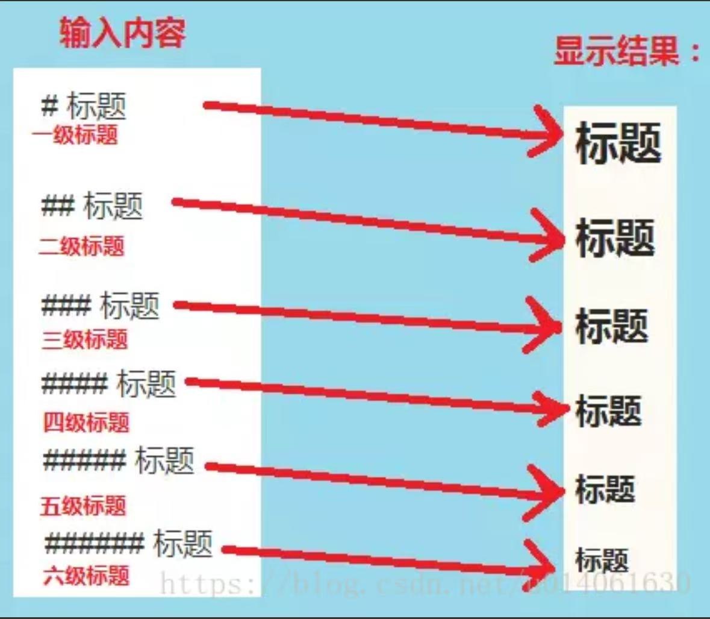
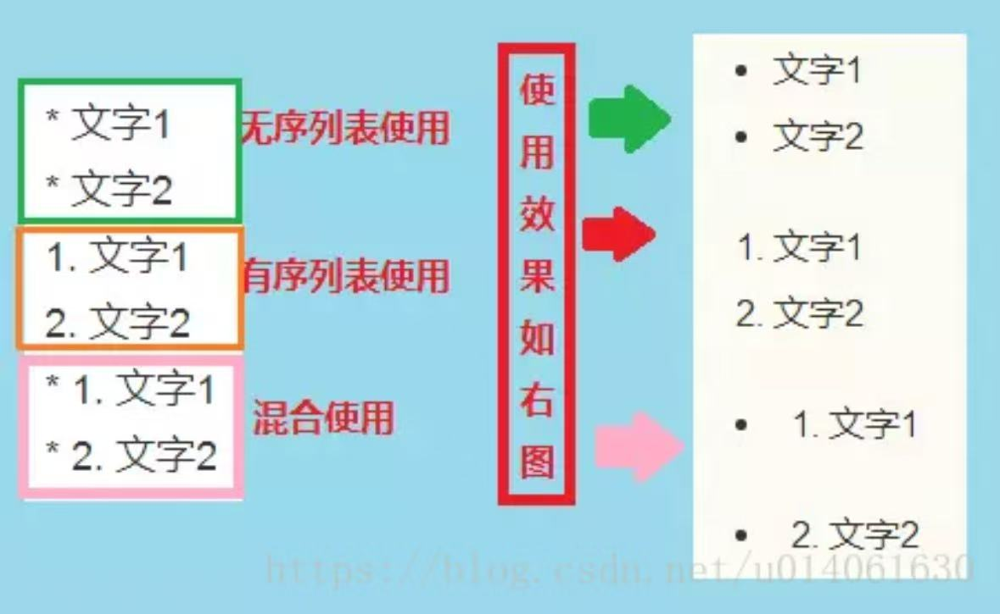
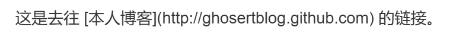
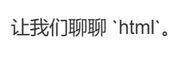
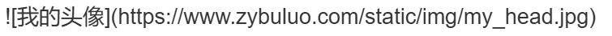
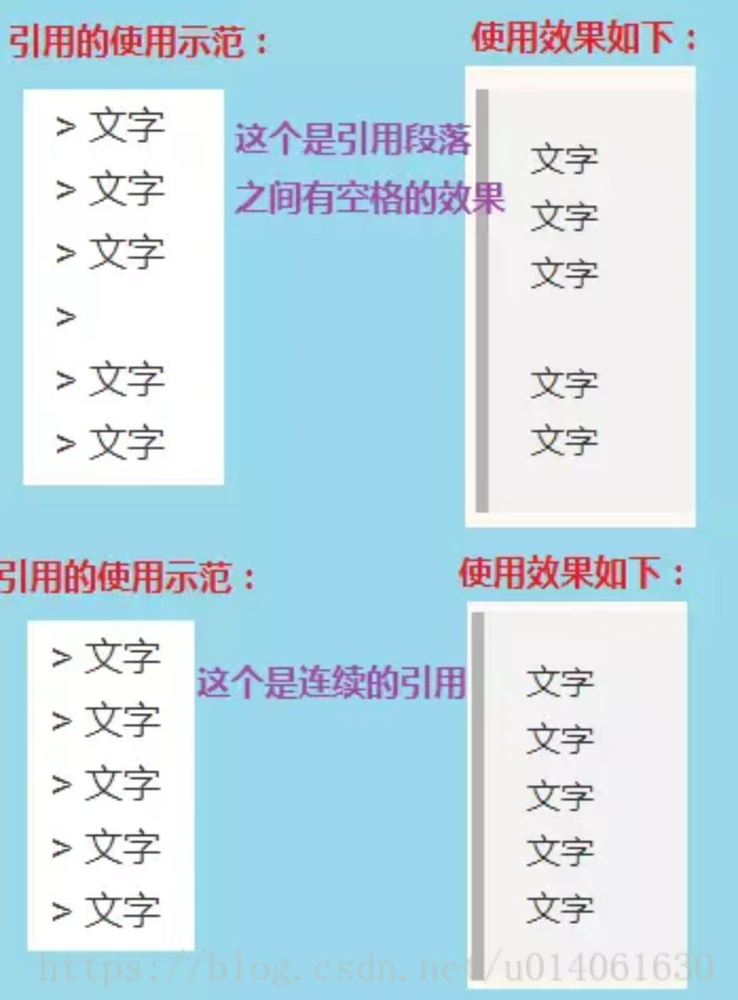
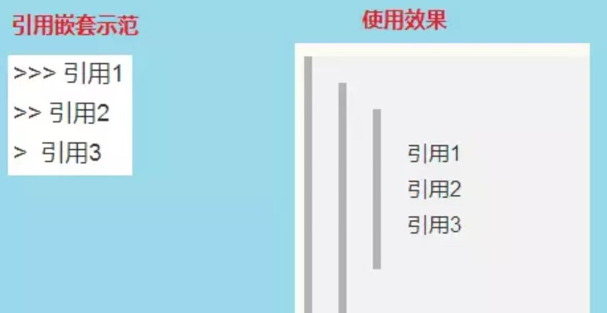
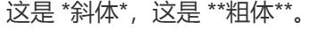

# Markdown 语法教学

### 导语

[Markdown](http://zh.wikipedia.org/wiki/Markdown) 是一种轻量级的「标记语言」，它
的优点很多，目前也被越来越多的写作爱好者，撰稿者广泛使用。看到这里请不要被
「标记」、「语言」所迷惑，Markdown 的语法十分简单。常用的标记符号也不超过十
个，这种相对于更为复杂的 HTML 标记语言来说，Markdown 可谓是十分轻量的，学
习成本也不需要太多，且一旦熟悉这种语法规则，会有一劳永逸的效果。

### 用什么工具？

[Markdown 编辑器](https://blog.csdn.net/luckydarcy/article/details/114481961?sharetype=blogdetail&s)
补充：
- macOS 平台：在 macOS 上可以使
用 [Mou](https://sspai.com/link?target=http%3A%2F%2Fmouapp.com%2F)，它支持实时
预览，既左边是你编辑 Markdown 语言，右边会实时的生成预览效果。
- iOS 端：已有相当多的 app 支持 Markdown 语法编辑，例如 Drafts、Day 
One、iA Writer 等。
- Web 端：我强烈推荐[简书](https://sspai.com/link?target=http%3A%2F%2Fjianshu.io%2F)这款产品，在 Web 端
使用 Markdown 没有比简书更舒服的地方了，它同样支持左右两栏的实时预览，字体
优雅、简洁，[Draftin](https://sspai.com/link?target=https%3A%2F%2Fdraftin.com%2F) 这款在线 MD 编辑器也近乎完美。

## Markdown 初级语法
### 1.标题
标题是每篇文章都需要也是最常用的格式，在 Markdown 中，如下图，如果一段文字被定义为标题，只要在这段文字前加 # 号即可。以此类推，总共六级标题，建议在井号后加一个空格，这是最标准的 Markdown 语法。



### 2.列表

熟悉 HTML 的同学肯定知道有序列表与无序列表的区别，在 Markdown 下，
* 列表的显示只需要在文字前加上 - 或 *或+ 即可变为无序列表，
* 有序列表则直接在文字前加1.2.3. ，注意符号要和文字之间加上一个字符的空格，起到缩进作用

无序列表和有序列表也可以同时使用，列表也可以与其他的 Markdown 语法混合使用，包括标题、引用、代码区域等。



### 3.外链接

使用 \[描述](链接地址) 为文字增加外链接。

示例：
这是去往 [本人博客](http://ghosertblog.github.com)的链接



### 4.行内代码块

使用 \`代码\` 表示行内代码块。

示例：
让我们聊聊 `html`。



### 5.代码块
使用

\```C++

\```
表示代码块
```c++
#include <iostream>
using namespace std;
int main()
{
    return 0 ;
}
```

### 6.插入图像

使用 \!\[描述](图片链接地址) 插入图像。
示例：



### 7.引用

如果你需要引用一小段别处的句子，那么就要用引用的格式。
> 文字

只需要在文本前加入 > 这种尖括号（大于号）即可

引用也可以嵌套使用，如下图所示：



### 8.斜体与粗体

使用 * 和 ** 表示斜体和粗体。

示例：



结果：这是 *斜体*，这是 **粗体**。