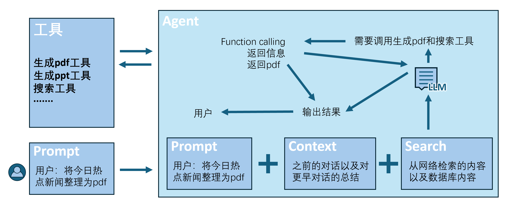

## 目录

1. [常用人工智能](#常用人工智能)
2. [常见AI模型类型](#常见ai模型类型)

推荐一下[李宏毅老师的课](https://speech.ee.ntu.edu.tw/~hylee/ml/2025-spring.php),如果你不是专门研究这个方向的，可以只需要学习第一节课,named一堂課搞懂生成式人工智慧的技術突破與未來發展，这节课听的幽默而又有意思，可惜的是这门课的后续其实并不适合小白，还是有点吃力的。这个章节的目的是让同学们意识到AI对当下程序的冲击力，我们的课程也要适应这个潮流，但如果纯AI，不禁发问:真正属于我们的能力有多少？

## 常用人工智能
因为部分国外AI可能存在国内访问限制，故放在国内AI后面。
### 代码
* DeepSeek（大模型）
深度求索旗下，推理与逻辑能力强。不同于智能体，大模型不能在IDE里直接写入文件，所有代码需要你自己复制。  
[https://www.deepseek.com/](https://www.deepseek.com/)
* 通义灵码（智能体）
阿里旗下，支持Qwen与DeepSeek大模型，兼容 Visual Studio Code、JetBrains IDEs，相当于把AI从网页端搬到IDE，使用方便。  
[https://lingma.aliyun.com/](https://lingma.aliyun.com/)
* Trae（智能体）
字节旗下，支持doubao与DeepSeek大模型，兼容 Visual Studio Code、JetBrains IDEs，使用方便。  
[https://www.trae.cn/](https://www.trae.cn/)

---
* cursor（智能体）
最主流的AI编程Agent，支持Claude，Gemini等模型，使用方便。  
[https://cursor.com/cn](https://cursor.com/cn)
* Claude（大模型）
代码唯一真神，逻辑推理和代码能力夯。  
[https://claude.com/](https://claude.com/)
* ChatGPT
OpenAI旗下，一度成为AI代名词，处理复杂问题能力强。  
[https://chat.openai.com/](https://chat.openai.com/)
* Gemini
Google旗下，背靠谷歌，实力强大，编码逻辑能力非常强。  
[https://gemini.google.com/](https://gemini.google.com/)
### 日常
* DeepSeek
深度求索旗下，推理与逻辑能力强。在中文AI中有较强实力。多模态能力较弱。   
[https://www.deepseek.com/](https://www.deepseek.com/)
* KiMi
月之暗面旗下，在超长上下文方面领先，可进行多轮对话，适合阅读长文本。  
[https://www.kimi.com/zh/](https://www.kimi.com/zh/)
* 通义千问
阿里旗下，实力较强，可以与DeepSeek扳手腕。  
[https://www.qianwen.com/](https://www.qianwen.com/)
* 豆包
字节跳动旗下，客户体验好，逻辑推理等专业能力弱，适合日常。在整合字节系产品内容方面有优势。  
[https://www.doubao.com/](https://www.doubao.com/)
* 智谱清言
数据分析、推理能力强，适合学术研究。  
[https://chatglm.cn/](https://chatglm.cn/)
* 混元
腾讯旗下，在整合腾讯系产品内容方面有优势，可以分析微信上海量内容。  
[https://hunyuan.tencent.com/](https://hunyuan.tencent.com/)
* 文心一言
百度旗下，国内发展较早的AI，如今实力有待提升。  
[https://yiyan.baidu.com/](https://yiyan.baidu.com/)

---
* ChatGPT
OpenAI旗下，一度成为AI代名词，能力毋庸置疑，全能型选手。  
[https://chat.openai.com/](https://chat.openai.com/)
* Gemini
Google旗下，背靠谷歌，实力强大，依旧全能型选手。  
[https://gemini.google.com/](https://gemini.google.com/)
* Claude
强调可靠性，代码能力超强，在逻辑、文字方面都一骑绝尘，多模态能力较弱。  
[https://claude.com/](https://claude.com/)
* Grok
能即时抓取互联网与 X 平台最新数据，主打 “直言不讳、幽默、少过滤”。  
[https://grok.x.ai/](https://grok.x.ai/)
* mistral
欧洲的AI大模型。  
[https://mistral.ai/](https://mistral.ai/)
### 图像生成
* 商汤秒画  
[https://miaohua.sensetime.com/](https://miaohua.sensetime.com/)
* 即梦  
[https://jimeng.jianying.com/](https://jimeng.jianying.com/)
* Liblib  
[https://www.liblib.art/](https://www.liblib.art/)
* 可灵  
[https://app.klingai.com/cn/](https://app.klingai.com/cn/)
* 通义万相  
[https://tongyi.aliyun.com/wan/explore](https://tongyi.aliyun.com/wan/explore)
* 海螺  
[https://hailuoai.com/](https://hailuoai.com/)

---
* 视频生成
* 即梦  
[https://jimeng.jianying.com/](https://jimeng.jianying.com/)
* 可灵  
[https://app.klingai.com/cn/](https://app.klingai.com/cn/)
* 通义万相  
[https://tongyi.aliyun.com/wan/explore](https://tongyi.aliyun.com/wan/explore)
* 海螺  
[https://hailuoai.com/](https://hailuoai.com/)
* Vidu  
[https://www.vidu.cn/](https://www.vidu.cn/)

---
* Runway  
[https://runwayml.com/](https://runwayml.com/)
* Pika  
[https://pika.art/](https://pika.art/)
* pixverse  
[https://pai.video/](https://pai.video/)
* Sora  
[https://openai.com/zh-Hans-CN/index/sora/](https://openai.com/zh-Hans-CN/index/sora/)
### 学习与创作
* Manus
生成PPTAI，这个强度比kimi强的不止一点，做ppt全靠这个，力推。
[https://manus.im/app](https://manus.im/app)
* AiPPT
生成PPTAI。  
[https://www.aippt.cn/](https://www.aippt.cn/)
* 笔灵  
AI写作助手  
[https://ibiling.cn/](https://ibiling.cn/)
* Minimax Music
AI生成音乐  
[https://www.minimaxi.com/audio/music](https://www.minimaxi.com/audio/music)
* 海绵音乐
AI生成音乐  
[https://www.haimian.com/](https://www.haimian.com/)
* 网易天音
AI生成音乐，可自由编辑。专业性强。  
[https://tianyin.music.163.com/](https://tianyin.music.163.com/)
* 豆包
声音克隆效果较好  
目前仅支持手机端app使用
* 讯飞智作
AI语音生成。  
[https://www.xfzhizuo.cn/](https://www.xfzhizuo.cn/)
* noiz
免费AI语音生成，功能强大。  
[https://noiz.ai/](https://noiz.ai/)
* azure
微软的语音生成，小帅配音的由来。  
[https://azure.microsoft.com/zh-cn/products/ai-foundry/tools/speech/](https://azure.microsoft.com/zh-cn/products/ai-foundry/tools/speech/)
* fishaudio
AI语音生成。  
[https://fishaudiocn.com/](https://fishaudiocn.com/)
* Google Scholar
学术搜索引擎，搜索全面快速。  
[https://scholar.google.com/](https://scholar.google.com/)
* research rabbit  
论文领域AI，梳理论文与作者关系，列出相关文献，文献库不如Google Scholar。  
[https://www.researchrabbit.ai/](https://www.researchrabbit.ai/)
* Tana
笔记与会议记录。  
[https://tana.inc/](https://tana.inc/)
* Gamma
PPT生成AI。  
[https://gamma.app/](https://gamma.app/)
* suno
音乐生成AI  
[https://suno.com/](https://suno.com/)
## AI汇总网站
* AI工具集
[https://ai-bot.cn/](https://ai-bot.cn/)
* toolify
[https://www.toolify.ai/zh/](https://www.toolify.ai/zh/)
* AI产品库
[https://aiproducthub.cn/](https://aiproducthub.cn/)

## 常见AI模型类型
### 什么是模型
模型就像是人的大脑，不同的模型使用不同的训练方式、训练数据来达到不同的特点、目的。而Agent则是像人的身体，在大脑的驱动下可以干各种事情。上文提到的智能体一般可以调用不同大模型，比如cursor可以选用Claude，Gemini等模型。Agent和大模型在一起就是我们日常使用的AI工具。下面的简图大致概括了AI工具的工作流程。

  

如果对相关内容感兴趣，可以看一下这个视频  
[https://www.bilibili.com/video/BV1ojfDBSEPv/](https://www.bilibili.com/video/BV1ojfDBSEPv/)
讲的比较易懂。
### 大语言模型（LLM） 
LLM是基于海量文本数据训练的大型神经网络模型，简单来说，他只能根据用户输入的提示词（prompt）以及大量训练的数据来推测输出内容，只会不断输出内容。我们日常见到的大多数是LLM，如GPT-4.5，DeepSeekV3。

### 潜在一致性模型（LCM） 
LCM主要用于图像生成，具有快速生成高质量图像的能力。它优化了速度和效率，适合在移动设备或低功耗硬件上运行。

### 专家混合模型（MoE） 
MoE由多个“专家”模型组成，每个专家专注于特定领域。通过智能路由机制，MoE能够高效处理复杂任务，常用于高性能AI系统、领域助手和多语言系统。
GPT-4，DeepSeek V3都使用了这项技术。实现高性能而节省算力。
### 视觉语言模型（VLM） 
VLM结合了视觉和语言处理能力，能够实现图像与文本的跨模态理解。它被广泛应用于多模态助手、图像描述、视觉问答和AR/VR等领域。AI识图搜题就用了这个模型。
###  小型语言模型（SLM） 
SLM是参数较少的语言模型，适合在本地部署。

