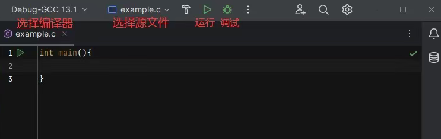
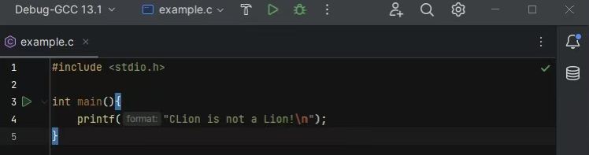
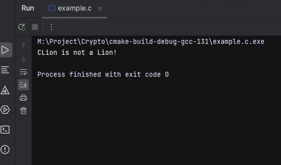
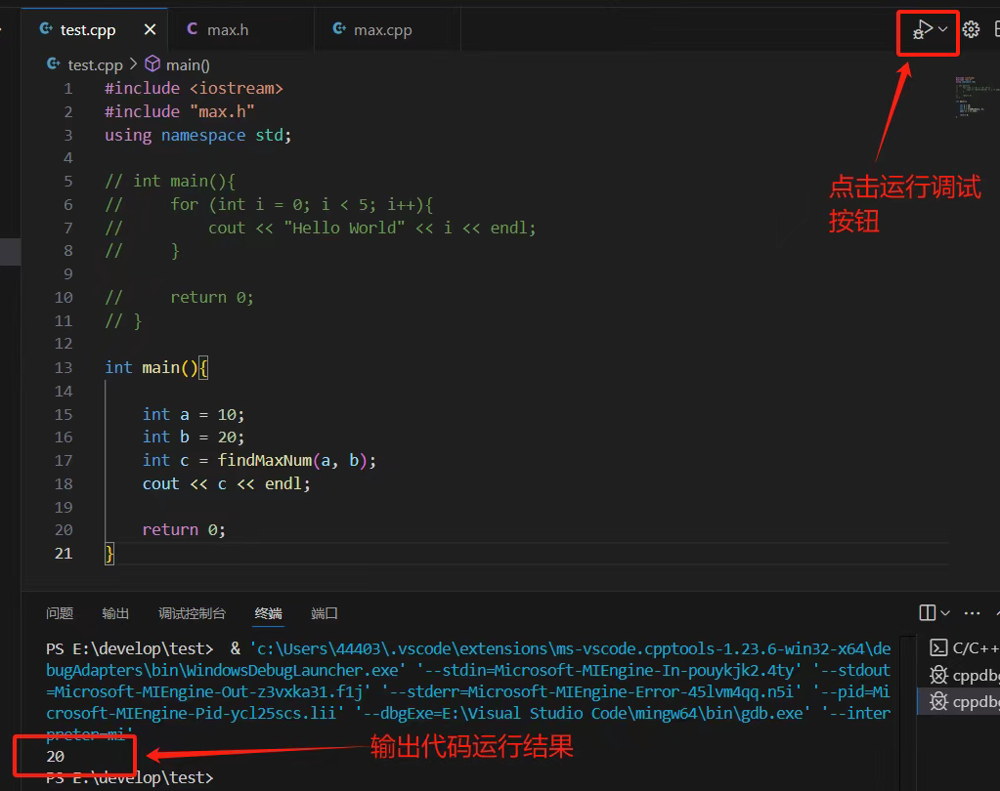

# Clion&VSCode 多文件 C++多文件项目操作指南

## 一、CLion 操作流程

### 1.新建项目
+ 打开 CLion，点击左上角 File → New → Project
+ 左侧选择 C++ Executable，右侧设置：
◦ 项目名（如 debug_test）、保存路径
◦ 语言标准选 C++17，构建系统默认 CMake
+ 点击 Create，完成项目创建
### 2. 多文件管理
+ 右键项目根目录 → New → C/C++ Source File
+ 新建.cpp 源文件（如 HistoryManager.cpp），勾选 Create associated header，自动生
成对应.h 头文件
+ 在 main.cpp（或 debug_demo.cpp）中#include "HistoryManager.h"，即可调用其他
文件的类/函数
### 3. 编译运行
+ 写好代码后，点击右上角的绿色三角运行按钮（或按快捷键 Shift+F10）
+ CLion 会自动完成所有.cpp 文件的编译、链接，生成可执行程序
+ 下方控制台会直接显示程序运行结果，出现 Process finished with exit code 0 即代
表运行成功


## 二、VSCode 操作流程

由于vscode管理C++分文件编写有点费劲，具体可以参考[这篇文章](https://blog.csdn.net/htxpz_6/article/details/134349613?sharetype=blogdetail&shareId=134349613&sharerefer=APP&sharesource=2501_94212048&sharefrom=link)
### 1. 新建项目
+ 手动创建项目文件夹（如 vscode_debug_test），用 VSCode 打开
+ 新建所有.h/.cpp 文件，结构与 CLion 一致
### 2. 配置多文件编译（tasks.json）
+ 按 Ctrl+Shift+P，输入 Tasks: Configure Task，选择 C/C++: g++.exe build active file
+ 替换.vscode/tasks.json 为以下配置：
```
{
 "version": "2.0.0",
 "tasks": [
 {
 "label": "g++ 编译多文件",
 "type": "shell",
 "command": "g++",
 "args": [
 "-g",
 "${fileDirname}/*.cpp",
 "-o",
 "${fileDirname}/debug_demo.exe",
 "-I${fileDirname}",
 "-std=c++17"
 ],
 "problemMatcher": ["$gcc"],
 "group": {
 "kind": "build",
 "isDefault": true
 }
 }
 ]
}
```
### 3. 编译运行
+ 按 Ctrl+Shift+B 执行编译，生成 debug_demo.exe
+ 终端输入./debug_demo.exe 运行程序
