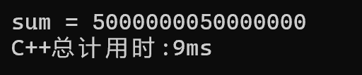
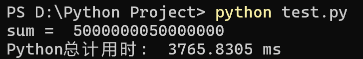

# 编译器与解释器

不同的语言有不同的运行方式，弄清楚底层的运行方式对运行会有很大帮助。

#### 基本概念
- 编译器 (Compiler)
    - 工作方式：在程序运行之前，一次性将整个源代码翻译成目标机器代码（通常是一个可执行文件，如 .exe）。
    - 执行流程：编写代码 -> 编译 (生成可执行文件) -> 运行 (直接执行机器码)。
    - 代表语言：C, C++, Rust, Go。
- 解释器 (Interpreter)
    - 工作方式：在程序运行时，逐行读取源代码，边翻译边执行，不生成独立的可执行文件。
    - 执行流程：编写代码 -> 运行 (解释器逐行翻译并执行)。
    - 代表语言：Python, Ruby, PHP, MATLAB。    

可以这么理解，你用中文写了一本书，要在国外卖，你有两种选择：  
1. 把书翻译为其他语言再放到书店卖，外国人买回家可以直接读。这就是编译器。  
2. 把中文原本的书与一名精通100国语言的翻译官捆绑销售，外国人买回家之后由翻译读给他听。这就是解释器。  

从这个例子中不难看出编译器与解释器有着各自的优点：  
- **编译器运行速度快**  
- **解释器能适配不同平台**  
   

| 特性 | 编译器 (Compiler) | 解释器 (Interpreter) |
| :--- | :--- | :--- |
| 翻译时机 | 运行前一次性翻译完成 | 运行时逐行翻译 |
| 输出结果 | 生成独立的可执行文件 (机器码) | 不生成独立文件 |
| 执行速度 | 快 (直接运行机器码) | 慢 (每次运行都要重新翻译) |
| 调试体验 | 较差 (需重新编译才能看到修改效果，报错指向编译阶段) | 好 (修改即运行，报错直接指向具体行号) |
| 跨平台性 | 较差 (需为不同操作系统分别编译) | 好 (只要有对应的解释器，代码即可通用) |
| 源码保护 | 较好 (分发的是二进制文件，难反编译) | 较差 (通常需要分发源代码) |
| 内存占用 | 运行时较低 (无需编译器驻留) | 运行时较高 (解释器需常驻内存) |

> PS:现代还有一些语言使用混合模式，既有编译也有解释。
#### 动手尝试
平台适配性无需多言。接下来通过一个例子，我们主要感受一下编译型语言在运行速度方面对解释型语言的降维打击。
C++  
```cpp
#include <iostream>
#include <chrono>
int main() {
    //获取当前高精度时间点
	auto start = std::chrono::high_resolution_clock::now();
	long long sum = 0;
	for (long long i = 1; i < 100000001; i++) {
		sum += i;
	}
	auto end = std::chrono::high_resolution_clock::now();
    //开始时间点减结束时间点得到总用时
	auto timer = std::chrono::duration_cast<std::chrono::milliseconds>(end - start);
	std::cout << "sum = " << sum << std::endl;
	std::cout << "C++总计用时:" << timer / std::chrono::milliseconds(1) << "ms" << std::endl;
}
```
Python
```python
import time
N = 100000000
sum = 0
start = time.perf_counter()
for i in range(1, N + 1):
    sum += i
end = time.perf_counter()
elapsed_ms = (end - start) * 1000
print(f"sum = ",sum)
print(f"Python总计用时: ",elapsed_ms,"ms")
```
上面的代码简单计算了一下从1到1亿的和，经过运行，我们得到了结果：  

   
  
由此不难看出，编译型语言比解释型语言快得多。
> 如果你看完上面的内容想进一步了解解释器，可以去体验一下这学期程序设计实践实验的Lab7（本学期不做要求）  
实验文件下载：https://github.com/moxiao11/ProPracitceLab
