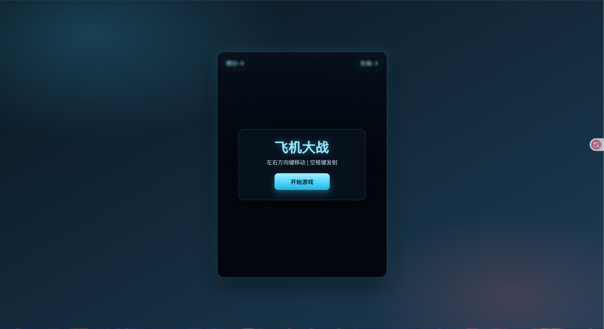

# 飞机大战的运行


### 编译运行

以下全部是命令行的知识

**Windows：**
```bat
cd game-core
mkdir build
cd build
cmake ..
cmake --build . --config Release
```

**Linux / Mac：**
```bash
cd game-core
mkdir -p build && cd build
cmake ..
make
```
### 启用node.js

```bash
cd server
npm install
npm start
```
### 打开

此时会显示一个本地的网址

打开 **http://localhost:xxxx** 即可游戏。

成功之后会显示如下图

